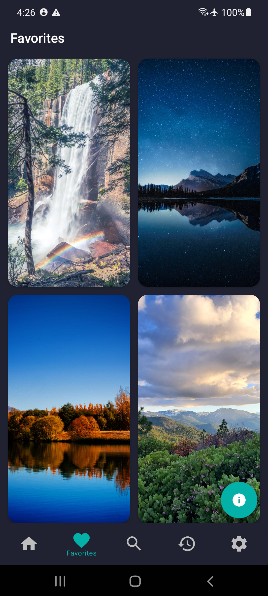
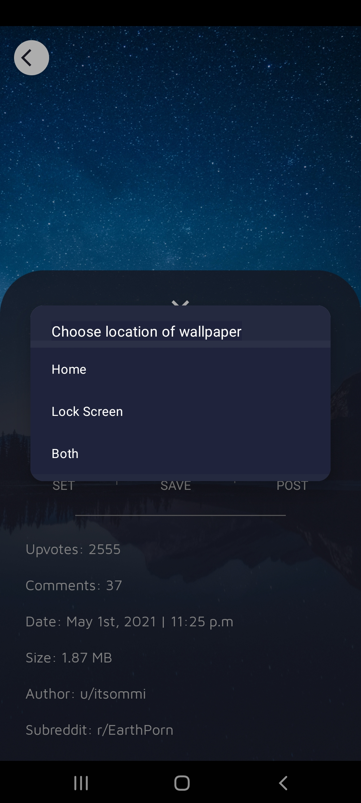

# Tapestry for Reddit - An unofficial wallpaper client
**A wallpaper app utilizing the Reddit API.  Pulls images from a specified subreddit to set as device wallpaper**

*Made with love ❤️ by [Drew](https://github.com/DrewStephensCoding)*

***Try latest app apk from below 👇***
**Coming Soon...**

## Built With 🛠
- [Kotlin](https://kotlinlang.org/) - First class and official programming language for Android development.
- [Coroutines](https://kotlinlang.org/docs/reference/coroutines-overview.html) - For asynchronous and more..
- [Material Components for Android](https://github.com/material-components/material-components-android) - Modular and customizable Material Design UI components for Android.
- [Glide v4](https://bumptech.github.io/glide/) - A fast and efficient image loading library for Android focused on smooth scrolling
- [Google Play Services - Open Source Notices](https://developers.google.com/android/guides/opensource) - Google Play services includes a set of tools designed to give developers an easier way to express the open source software notices of libraries used in their apps.

## Features
- Toggle between light and dark themes
- Loads images from a specified subreddit into a linear user interface (Future plans include toggling view from linear to grid)
- Preview image and have the option to set it as a wallpaper
- Options between setting the home or lock screen wallpaper
- Specify the image resolution in settings
- Specify a default subreddit to load from on start up
- Sort Reddit images by new, hot, or top
- Search for subreddits
- Ability to download the image
- Save favorite images to be viewed later
- Set scale down for images being loaded in gridview to minimize bandwidth consumption
- View history of downloaded or set wallpapers

## Architecture 
This app uses [***MVVM (Model View View-Model)***](https://developer.android.com/jetpack/docs/guide#recommended-app-arch) architecture.

### Screenshots
&nbsp;  &nbsp;  &nbsp;  &nbsp;  &nbsp;  &nbsp;  &nbsp;  

## License
```
MIT License

Copyright (c) 2020 DrewStephensCoding

Permission is hereby granted, free of charge, to any person obtaining a copy
of this software and associated documentation files (the "Software"), to deal
in the Software without restriction, including without limitation the rights
to use, copy, modify, merge, publish, distribute, sublicense, and/or sell
copies of the Software, and to permit persons to whom the Software is
furnished to do so, subject to the following conditions:

The above copyright notice and this permission notice shall be included in all
copies or substantial portions of the Software.

THE SOFTWARE IS PROVIDED "AS IS", WITHOUT WARRANTY OF ANY KIND, EXPRESS OR
IMPLIED, INCLUDING BUT NOT LIMITED TO THE WARRANTIES OF MERCHANTABILITY,
FITNESS FOR A PARTICULAR PURPOSE AND NONINFRINGEMENT. IN NO EVENT SHALL THE
AUTHORS OR COPYRIGHT HOLDERS BE LIABLE FOR ANY CLAIM, DAMAGES OR OTHER
LIABILITY, WHETHER IN AN ACTION OF CONTRACT, TORT OR OTHERWISE, ARISING FROM,
OUT OF OR IN CONNECTION WITH THE SOFTWARE OR THE USE OR OTHER DEALINGS IN THE
SOFTWARE.
```
